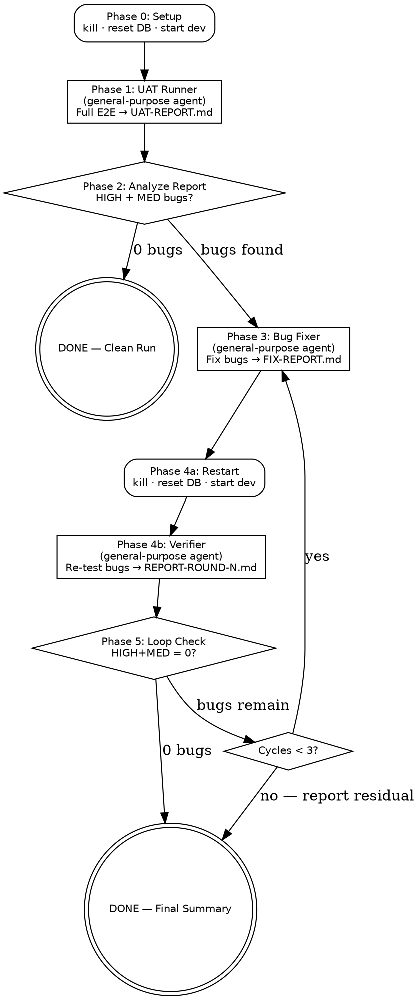

# UAT Loop — Iterative E2E Test, Fix & Retest

Orchestrates a multi-agent iterative UAT cycle: run full E2E → report bugs → fix bugs → re-test → repeat until clean. Maximum 3 fix cycles.

## Flow



## Constants

| Setting | Value |
|---------|-------|
| Max fix cycles | 3 |
| Stop condition | 0 HIGH + 0 MEDIUM bugs |
| Report directory | `uat/` |
| Dev server | `localhost:3000` |
| DB path | `db/openself.db` |

---

## Phase 0 — Setup

Execute ALL steps automatically. No user interaction.

### 0.1 Create UAT directory
```bash
mkdir -p ~/dev/repos/openself/uat
```

### 0.2 Record starting point
```bash
cd ~/dev/repos/openself && echo "branch: $(git branch --show-current), commit: $(git rev-parse --short HEAD)" > uat/start-state.txt
```

### 0.3 Run unit tests (baseline)
```bash
cd ~/dev/repos/openself && npx vitest run 2>&1 | tail -5 | tee uat/baseline-tests.txt
```
If tests fail, STOP and report to user. Do not start UAT on a broken codebase.

### 0.4 Kill existing instances
```bash
lsof -ti:3000 | xargs -r kill -9 2>/dev/null || true
pkill -f "next-router-worker" 2>/dev/null || true
pkill -f "next dev.*openself" 2>/dev/null || true
```
Wait 2 seconds.

### 0.5 Reset database
```bash
cd ~/dev/repos/openself && rm -f db/openself.db db/openself.db-shm db/openself.db-wal
```

### 0.6 Start dev server (background)
```bash
cd ~/dev/repos/openself && npm run dev
```
Use `run_in_background: true`. Wait ~5 seconds.

### 0.7 Wait for server ready
```bash
for i in $(seq 1 10); do curl -s -o /dev/null -w "%{http_code}" http://localhost:3000 2>/dev/null | grep -q 200 && echo "READY" && break; sleep 3; done
```

### 0.8 Confirm with Playwright
Navigate to `http://localhost:3000`, take screenshot `uat/00-server-ready.png`.

---

## Phase 1 — UAT Runner Agent

**Before spawning the runner, ask the user which mode to use:**

| Mode | Skill | Description |
|------|-------|-------------|
| **Scripted** | `/uat` | Fixed persona (Marco), deterministic path, reproducible |
| **Exploratory** | `/uat-explore` | Random persona, adaptive conversation, discovers edge cases |

Spawn a **single** `general-purpose` agent (foreground, need its result):

**Agent name:** `uat-runner`

### If Scripted mode:

**Prompt:**

```
You are a QA Automation Engineer running a full E2E UAT cycle for the OpenSelf project.

SETUP IS ALREADY DONE — the dev server is running on http://localhost:3000 with a fresh database. Do NOT perform any setup steps.

Read the file /home/tommaso/dev/repos/openself/.claude/commands/uat.md and follow it COMPLETELY, starting from "STEP 2 — Home + Navigation" through "STEP 12 — Generate Report".

SKIP the entire "Setup — Fully Automated" section — it's already done.

Write the report to /home/tommaso/dev/repos/openself/uat/UAT-REPORT.md.
Save all screenshots to /home/tommaso/dev/repos/openself/uat/ with the filenames specified in the skill.

When done, close the browser.
```

### If Exploratory mode:

**Prompt:**

```
You are a QA Automation Engineer running an exploratory E2E UAT for the OpenSelf project.

SETUP IS ALREADY DONE — the dev server is running on http://localhost:3000 with a fresh database. Do NOT perform any setup steps.

Read the file /home/tommaso/dev/repos/openself/.claude/commands/uat-explore.md and follow it COMPLETELY, starting from "PHASE 1 — Persona Generation" (skip PHASE 0 — Setup).

Write the report to /home/tommaso/dev/repos/openself/uat/UAT-REPORT.md.
Save all screenshots to /home/tommaso/dev/repos/openself/uat/ with the filenames specified in the skill.
IMPORTANT: All screenshots MUST use fullPage: true.

When done, close the browser.
```

This is the longest phase (~15-30 min). Wait for completion.

---

## Phase 2 — Report Analysis

After the runner agent completes:

### 2.1 Read the report
Read `uat/UAT-REPORT.md` in full.

### 2.2 Count bugs by severity
```bash
cd ~/dev/repos/openself && grep -oP '\| \d+ \| \w+ \| (High|Medium|Low)' uat/UAT-REPORT.md | grep -c "High" || echo "0"
```
```bash
cd ~/dev/repos/openself && grep -oP '\| \d+ \| \w+ \| (High|Medium|Low)' uat/UAT-REPORT.md | grep -c "Medium" || echo "0"
```

### 2.3 Decision
- **0 HIGH and 0 MEDIUM** → Announce clean run, skip to Phase 6
- **Any HIGH or MEDIUM** → Announce bug count to user, continue to Phase 3

Set `CYCLE=1`.

---

## Phase 3 — Bug Fixer Agent

Spawn a `general-purpose` agent (foreground):

**Agent name:** `uat-fixer-{CYCLE}`

**Prompt** (substitute `{CYCLE}` and `{REPORT_FILE}` with actual values):

```
You are a senior developer fixing bugs found during UAT testing of the OpenSelf project.

Working directory: /home/tommaso/dev/repos/openself

## Task

1. Read the project conventions: /home/tommaso/dev/repos/openself/CLAUDE.md
2. Read the UAT bug report: /home/tommaso/dev/repos/openself/uat/{REPORT_FILE}
3. Focus ONLY on HIGH and MEDIUM severity bugs in the Bug Log table
4. For each bug (in severity order, HIGH first):
   a. Read the description and referenced screenshot
   b. Locate the root cause in the codebase
   c. Implement a minimal, targeted fix
   d. Do NOT refactor surrounding code
5. After all fixes, run the test suite: npx vitest run
6. If any tests fail, fix the regressions (fix your code, never modify tests to pass)
7. Run TypeScript check: npx tsc --noEmit
8. Write your report to: /home/tommaso/dev/repos/openself/uat/FIX-REPORT-{CYCLE}.md

## Fix Report Format

# Fix Report — Round {CYCLE}
**Date:** [today]
**Bugs addressed:** [count]
**Bugs skipped:** [count + reasons]

| Bug # | Severity | Description | Root Cause | Fix | Files Changed |
|-------|----------|-------------|------------|-----|---------------|
| ...   | ...      | ...         | ...        | ... | ...           |

## Test Results
- Before fixes: [X tests, Y passed, Z failed]
- After fixes: [X tests, Y passed, Z failed]

## Skipped Bugs
[Any bugs that require architectural changes or are out of scope — explain why]

## Notes
[Trade-offs, decisions, anything the verifier should know]

## Rules
- Do NOT start or touch the dev server
- Do NOT modify the database directly
- Do NOT modify test files to make tests pass
- Prefer surgical fixes over broad refactoring
- If a bug requires an architectural change, document it in Skipped Bugs and move on
- If you're unsure about a fix, err on the side of NOT changing it and documenting why
```

Wait for the fixer to complete. Read `uat/FIX-REPORT-{CYCLE}.md` to confirm work was done.

---

## Phase 4 — Restart & Verify

### 4a. Restart environment

The fixer changed code, so we need a fresh server + DB:

```bash
lsof -ti:3000 | xargs -r kill -9 2>/dev/null || true
pkill -f "next-router-worker" 2>/dev/null || true
pkill -f "next dev.*openself" 2>/dev/null || true
```
Wait 2 seconds.

```bash
cd ~/dev/repos/openself && rm -f db/openself.db db/openself.db-shm db/openself.db-wal
```

Start dev server (background):
```bash
cd ~/dev/repos/openself && npm run dev
```

Wait for ready (same poll as Phase 0.7).

### 4b. Verifier Agent

Spawn a `general-purpose` agent (foreground):

**Agent name:** `uat-verifier-{CYCLE}`

**Prompt** (substitute `{CYCLE}` and paths):

```
You are a QA verification engineer for the OpenSelf project. Your job is to RE-TEST specific bugs that were found and supposedly fixed.

Working directory: /home/tommaso/dev/repos/openself

## Context Files
- Original bug report: /home/tommaso/dev/repos/openself/uat/UAT-REPORT.md
- Fix report: /home/tommaso/dev/repos/openself/uat/FIX-REPORT-{CYCLE}.md

Read BOTH files first.

## Task

For each HIGH and MEDIUM bug in the original UAT-REPORT.md:

1. Read the bug description, the step where it was found, and what fix was applied
2. Navigate to http://localhost:3000 with Playwright
3. Reproduce the EXACT scenario that triggered the bug:
   - Use the same persona: Marco, Italian UX designer, freelance, Milano
   - Send SHORT messages in Italian (5-15 words, like a real user)
   - Follow the same conversational flow until you reach the bug's trigger point
4. Verify the bug is fixed:
   - Use Playwright for browser interactions and screenshots
   - Use sqlite3 for DB verification: sqlite3 /home/tommaso/dev/repos/openself/db/openself.db
5. Take a screenshot: /home/tommaso/dev/repos/openself/uat/verify-{CYCLE}-bug{N}.png
6. Record result: PASS (fixed) / FAIL (still broken) / REGRESSED (new issue from fix)

## Conversation simulation rules
- Short messages: "Ciao! Sono Marco", "Faccio il designer, UX a Milano"
- Read agent replies and respond naturally
- Only go as deep into conversation as needed to reach the bug's trigger
- For layout/theme bugs: you can ask directly "Metti il layout bento" etc.

## Report

Write /home/tommaso/dev/repos/openself/uat/UAT-REPORT-ROUND-{CYCLE}.md:

# UAT Verification — Round {CYCLE}
**Date:** [today]
**Bugs re-tested:** [count]

## Summary
| Metric | Count |
|--------|-------|
| Re-tested | N |
| PASS (fixed) | N |
| FAIL (still broken) | N |
| REGRESSED (new issue) | N |
| New bugs found | N |

## Verification Results
| Original # | Severity | Description | Result | Screenshot | Notes |
|------------|----------|-------------|--------|------------|-------|
| 1          | High     | ...         | PASS   | verify-{CYCLE}-bug1.png | ... |
| 2          | Medium   | ...         | FAIL   | verify-{CYCLE}-bug2.png | Still broken because... |

## New Bugs Found (if any)
| # | Type | Severity | Description | Screenshot |
|---|------|----------|-------------|------------|
| N1 | ... | High/Med/Low | ... | verify-{CYCLE}-new1.png |

## Notes
[Anything noteworthy about the verification process]

## Important
- The dev server is already running on localhost:3000 with a fresh database
- Do NOT perform any setup
- When done, close the browser
```

Wait for the verifier to complete.

---

## Phase 5 — Loop Decision

### 5.1 Read verification report
Read `uat/UAT-REPORT-ROUND-{CYCLE}.md`.

### 5.2 Count remaining issues
Count FAIL + REGRESSED entries with HIGH or MEDIUM severity. Also count NEW bugs with HIGH or MEDIUM severity.

### 5.3 Decision tree

```
remaining_issues = FAIL(high+med) + REGRESSED(high+med) + NEW(high+med)

IF remaining_issues == 0:
    → Phase 6 (success!)

ELIF CYCLE < 3:
    → Increment CYCLE
    → Update REPORT_FILE to "UAT-REPORT-ROUND-{CYCLE-1}.md" (verifier's report becomes the fixer's input)
    → Back to Phase 3

ELSE:
    → Phase 6 (report residual issues)
```

Announce the decision to the user before proceeding.

---

## Phase 6 — Final Summary

### 6.1 Kill dev server
```bash
lsof -ti:3000 | xargs -r kill -9 2>/dev/null || true
pkill -f "next-router-worker" 2>/dev/null || true
pkill -f "next dev.*openself" 2>/dev/null || true
```

### 6.2 Collect final test results
```bash
cd ~/dev/repos/openself && npx vitest run 2>&1 | tail -5
```

### 6.3 Collect git diff stats
```bash
cd ~/dev/repos/openself && git diff --stat
```

### 6.4 Write summary report

Create `uat/UAT-LOOP-SUMMARY.md`:

```markdown
# UAT Loop Summary
**Date:** [today]
**Branch:** [git branch --show-current]
**Start commit:** [from uat/start-state.txt]
**End state:** [git rev-parse --short HEAD] (uncommitted changes: yes/no)
**Total cycles:** [N]
**Final status:** [CLEAN / RESIDUAL ISSUES]

## Cycle History

| Cycle | Phase | HIGH | MED | LOW | Fixed | New | Remaining |
|-------|-------|------|-----|-----|-------|-----|-----------|
| 1 | UAT | X | X | X | — | — | X |
| 1 | Fix+Verify | X | X | X | X | X | X |
| 2 | Fix+Verify | X | X | X | X | X | X |
| ... | | | | | | | |

## Resolved Bugs (across all cycles)

| Bug # | Severity | Description | Fixed in Cycle | Files Changed |
|-------|----------|-------------|----------------|---------------|
| ... | ... | ... | ... | ... |

## Remaining Bugs (if any)

| Bug # | Severity | Description | Reason Not Fixed |
|-------|----------|-------------|------------------|
| ... | ... | ... | architectural / max cycles / ... |

## Test Suite
- Baseline (before UAT): [from uat/baseline-tests.txt]
- Final: [X tests, Y passed, Z failed]

## Files Changed
[git diff --stat output]

## Reports Index

| File | Description |
|------|-------------|
| uat/UAT-REPORT.md | Initial full E2E report |
| uat/FIX-REPORT-1.md | Round 1 fixes |
| uat/UAT-REPORT-ROUND-1.md | Round 1 verification |
| ... | ... |
| uat/UAT-LOOP-SUMMARY.md | This file |

## Screenshot Index

[List all uat/*.png files with descriptions]
```

### 6.5 Announce results

Print a concise summary to the user:
- Total cycles run
- Bugs found / fixed / remaining
- Test suite status
- Whether code changes are uncommitted (remind user to review + commit)
